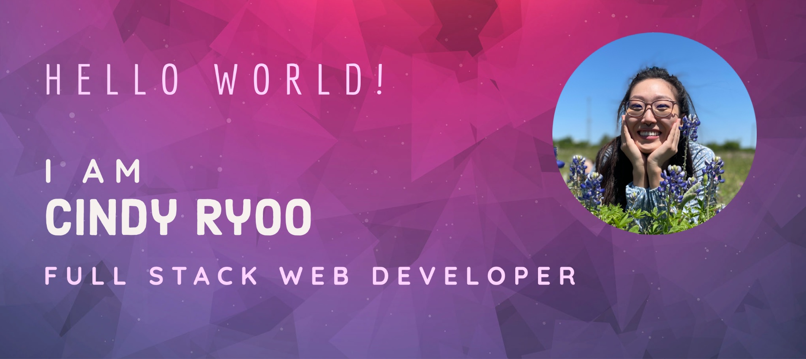

  

## 💁‍♀️ About Me:
My name is Cindy (she/her/hers), and I am a highly organized software engineer skilled in the MERN stack and seeking a role in full stack web development! I am a creative problem solver who is curious about emerging technologies and passionate about inclusion and diversity.

I primarily work in JavaScript and React on the frontend, and C#, Node, and SQL/noSQL databases on the backend. I’m a life-long learner who thrives in open, communicative team environments where we collaborate to engineer efficient solutions to real-world problems. In my free time, I like to bake sourdough, listen to EDM, and try new foods!

## 💻 Technical Skills:

| Type | Technologies |
| --- | --- |
| Frontend |           |
| Backend |           |
| Developer Tools |               |
Current Learning |     |

## 📈 Github Stats

## 💬 How to reach me:
 